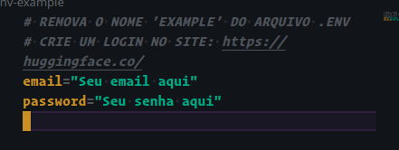

## GUI - Assistente Pessoal

## Descrição

GUI é uma assistente pessoal escrita em Python3 que pode ajudar em tarefas do dia a dia, como tirar dúvidas, e fornecer companhia. supercapaz de se comunicar de forma natural e informativa.

## Instalação

### Para instalar a GUI, siga estas etapas:

    1º Crie uma conta no site da HuggingFace: https://huggingface.co/

    2º Crie uma conta >>> Gere seu email e senha no site

    3º Clone o repositório da GUI: https://github.com/wendellast/Gui
HuggingFace:   https://huggingface.co/

git clone https://github.com/wendellast/Gui

## Crie um ambiente virtual e Ativa:
    # Linux
        python3 -m venv venv
        source venv/bin/activate

    # Windows
        python -m venv venv
        source venv/Script/activate

## Instale as dependências:

    pip install -r requirements.txt

## Remova o nome "-EXAMPLE" do arquivo .env:
    Remova o nome "-example" do arquivo .env

    Depois abra abra o arquivo .env e coloque o seu email e senha, da conta gerada no site HuggingFace: https://huggingface.co/




    Salve o arquivo e feche-o.

## Uso

### Para iniciar a GUI, execute o seguinte comando: ``` python3 gui.py ```


    # Linux:
        python3 gui.py

    # Windows:
        python gui.py

A GUI será aberta em uma interface grafica no terminal


## Contribuições

Contribuições são bem-vindas. Se você quiser contribuir para o projeto, siga estas etapas:

    Faça um fork do repositório no GitHub.
    Faça suas alterações no código.

    Teste suas alterações.
    rode o comando task apple e task orange antes de enviar a contribuição

    Faça um pull request para o repositório principal.

## Rode os comandos antes de enviar o pull request

### Comando verificar se algo indefinição na nomeclatua do codigo: ```task apple```

### Comando para conserta e ajuste de codigo: ``` task orange```
